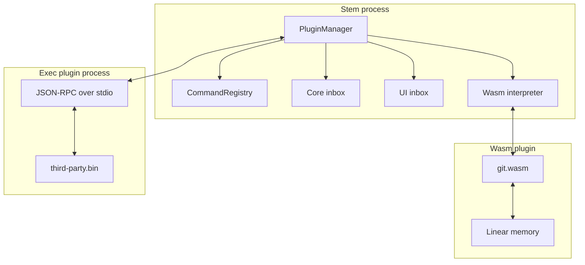

# Stem Plugins

Stem has a manifest-driven plugin system with two runtimes: a
sandboxed pure-Zig `wasm` interpreter and an out-of-process `exec`
runtime that talks JSON-RPC over stdio. Both load from
`~/.stem/plugins/<name>/`, share the same `plugin.json` schema and
permission model, and plug into the command palette through
`PluginManager`.

This document is the single reference for both authors writing
plugins and contributors working on the host-side internals.

## Contents

- [Overview](#overview)
- [Directory layout](#directory-layout)
- [Manifest](#manifest)
- [Permissions](#permissions)
- [Restart policy](#restart-policy)
- [Wasm runtime](#wasm-runtime)
- [Exec runtime](#exec-runtime)
- [Plugin CLI](#plugin-cli)
- [Bundled plugins](#bundled-plugins)
- [Host internals](#host-internals)
- [Design principles](#design-principles)
- [Current limitations](#current-limitations)

---

## Overview

| Runtime | Artifact | Isolation | Best for |
|---|---|---|---|
| `wasm` | `<name>.wasm` (wasm32-freestanding) | Stem's pure-Zig wasm interpreter | Small, sandboxed commands with narrow host needs |
| `exec` | Native executable | OS process boundary, framed JSON-RPC | Plugins needing their own runtime, deps, or language ecosystem |

Both runtimes share:

- `plugin.json` metadata and command declarations
- Permission allowlists for host capabilities
- Command palette registration via `PluginManager`
- Cleanup of registered commands and permission records on unload

The exec runtime adds an optional crash-restart policy; wasm plugins
are stateless across activation so they don't need one.

## Directory layout

Each plugin lives in its own directory:

```text
my-plugin/
├── plugin.json
└── my-plugin.wasm            # runtime: "wasm"
```

or:

```text
my-plugin/
├── plugin.json
└── stem-my-plugin            # runtime: "exec"
```

Installed plugins land under `~/.stem/plugins/<name>/`. Bundled
plugins ship under `<install-prefix>/lib/stem/plugins/<name>/` and
are seeded into the per-user dir on first run. The `install.sh`
script copies each bundled directory into both locations, re-codesigns
the installed `stem` binary on macOS (so the adhoc signature
survives `cp`), and sweeps leftover `*.dylib` / `*.so` / `*.dll`
files out of the per-user directory.

## Manifest

Every plugin must provide `plugin.json`:

```json
{
  "name": "my_plugin",
  "version": "0.1.0",
  "description": "Example stem plugin",
  "runtime": "wasm",
  "entry": "my-plugin.wasm",
  "restart": "on_crash",
  "permissions": {
    "spawn": ["git"],
    "events": ["buffer.*"],
    "filesystem": ["read:."]
  },
  "commands": [
    {
      "id": "my_plugin.hello",
      "title": "[My Plugin] Hello",
      "description": "Log a greeting"
    }
  ]
}
```

### Fields

| Field | Required | Notes |
|---|---|---|
| `name` | yes | Stable plugin id. Must be unique across loaded plugins. |
| `version` | yes | Plugin version shown by `stem plugin list/info`. |
| `description` | yes | Human-readable summary. |
| `runtime` | yes | `wasm` or `exec`. |
| `entry` | yes | Artifact path relative to the plugin directory. |
| `restart` | no | `never` (default), `on_crash`, or `always`. Applies to exec plugins; ignored for wasm. |
| `permissions` | no | Capability allowlists. Missing permissions default to deny. |
| `commands` | no | Commands registered into the palette before runtime activation. |

`PluginManager.tryLoadPluginDir` reads the manifest, eagerly
registers every declared command into the palette (so commands stay
discoverable even if the plugin later fails to start), installs the
permissions and restart policy, then hands off to the
runtime-specific loader.

Manifest command registration is the primary path. Runtime
self-registration (via `stem_register_command` for wasm or
`plugin/registerCommand` for exec) is supported for
runtime-conditional commands and dedupes against manifest-declared
ids.

## Permissions

Permissions are declared in the manifest and enforced by the host
where the corresponding capability is wired. Plugins with no
`permissions` entry default to deny.

| Permission | Status | Description |
|---|---|---|
| `spawn` | enforced for wasm | Allowlist of executable names accepted by `stem_spawn_capture`. Plugins outside the list get an empty return so they can surface a clean error. |
| `events` | checked on subscribe | Validates requested `protocol.PluginEvent` topic names. Broadcast delivery into plugins is still pending. |
| `filesystem` | declared only | Reserved for future file-access gates. |
| `manage_plugins` | enforced for wasm | Required to call `stem_load_plugin` / `stem_unload_plugin`. |

Entries support a trailing `*` glob (`buffer.*`).

## Restart policy

For exec plugins, the optional `restart` field controls what
happens when the child process exits:

| Value | Behaviour |
|---|---|
| `never` (default) | Crash → drop the plugin, log a warning. Plugin stays down until the user reloads. |
| `on_crash` | Re-spawn with a 1 s → 5 s → 30 s backoff. After three failures the plugin gives up and the user must reload manually. |
| `always` | Same as `on_crash` today; reserved for future "restart on clean exit too" semantics. |

A successful re-load clears the backoff counter. Restart bookkeeping
lives in `restart_state` / `pending_restarts` in
[src/plugins/manager.zig](../src/plugins/manager.zig); restarts run
on the core loop tick so spawns never originate inside a reader
thread that's still unwinding.

## Wasm runtime

Wasm plugins are compiled as `wasm32-freestanding` executables with
no entry point. They export lifecycle functions and import a narrow
host surface from the `env` namespace. Sandbox boundaries are
enforced by the interpreter — a real wasm trap halts inside the
interpreter and never unwinds through stem.

### Host imports

| Import | Signature | Purpose |
|---|---|---|
| `stem_log` | `(level, ptr, len)` | Write a log line into stem's logger. |
| `stem_register_command` | `(id, title, desc)` | Register a runtime-conditional command (manifest registration is the primary path). |
| `stem_show_notification` | `(level, ptr, len)` | Host callback exists; visible UI presentation is still being wired. |
| `stem_open_buffer` | `(name, content)` | Open a virtual buffer in the editor. |
| `stem_spawn_capture` | `(cmd, out_buf, out_max) → i32` | Run an allow-listed process and copy stdout into wasm memory; gated by `permissions.spawn`. |
| `stem_load_plugin` / `stem_unload_plugin` | `(name)` | Plugin management; requires `manage_plugins`. |

### Exports

| Export | Called when | Notes |
|---|---|---|
| `activate()` | Once at load | Typically registers runtime-conditional commands. |
| `handle_command(id_ptr, id_len)` | Command palette invocation | Manifest-declared commands route here. |
| `deactivate()` (optional) | Shutdown / unload | Best-effort. |

### Minimal example

```zig
const std = @import("std");

extern "env" fn stem_log(level: i32, ptr: [*]const u8, len: i32) void;
extern "env" fn stem_register_command(
    id_ptr: [*]const u8,
    id_len: i32,
    title_ptr: [*]const u8,
    title_len: i32,
    desc_ptr: [*]const u8,
    desc_len: i32,
) void;

const CMD_ID = "my_plugin.hello";
const TITLE = "[My Plugin] Hello";
const DESC = "Log a greeting";

export fn activate() void {
    stem_register_command(CMD_ID.ptr, CMD_ID.len, TITLE.ptr, TITLE.len, DESC.ptr, DESC.len);
}

export fn handle_command(id_ptr: [*]const u8, id_len: i32) void {
    const id = id_ptr[0..@intCast(id_len)];
    if (std.mem.eql(u8, id, CMD_ID)) {
        const msg = "hello from wasm";
        stem_log(1, msg.ptr, msg.len);
    }
}
```

The bundled `echo`, `git`, and `plugin_manager` plugins are the
current references. The interpreter implements MVP wasm plus the
bulk-memory `memory.init` / `data.drop` opcodes so plugins can ship
passive data segments.

## Exec runtime

An exec plugin is a separate executable; the host spawns it as a
child process and frames JSON-RPC 2.0 messages over stdio with
LSP-style framing:

```text
Content-Length: <bytes>\r\n
\r\n
{"jsonrpc":"2.0","method":"plugin/log","params":{"level":1,"message":"ready"}}
```

### Host → plugin

| Method | Purpose |
|---|---|
| `plugin/initialize` | First message after spawn. |
| `command/execute` | User invoked a command owned by the plugin. |
| `plugin/shutdown` | Request a clean exit. |

### Plugin → host

| Method | Purpose |
|---|---|
| `plugin/log` | Write a log line. |
| `plugin/registerCommand` | Register a runtime command. |
| `plugin/subscribeEvent` | Subscribe to an event topic; permission is checked, broadcast delivery is still pending. |
| `editor/showNotification` | Host accepts the message; visible UI presentation is still being wired. |

If your exec plugin sets `"restart": "on_crash"`, the host will
re-spawn it with backoff after an unexpected exit (see
[Restart policy](#restart-policy)).

See [src/plugins/process_loader.zig](../src/plugins/process_loader.zig)
and [src/plugins/jsonrpc.zig](../src/plugins/jsonrpc.zig) for the
host-side implementation.

## Plugin CLI

Use the built-in CLI for local operator workflows:

```bash
stem plugin list                 # installed plugins with version + runtime
stem plugin info <name>          # pretty-print the manifest
stem plugin install <path>       # copy a plugin directory into ~/.stem/plugins
stem plugin remove <name>        # delete an install
stem plugin test <path>          # hermetic smoke test
```

`stem plugin test` validates the manifest and entry artifact. For
wasm plugins it also decodes the module and runs `activate()`
against mocked host imports, reporting registered commands.

The CLI lives in
[src/tools/plugin_cli.zig](../src/tools/plugin_cli.zig).

## Bundled plugins

| Name | Runtime | Commands | Notes |
|---|---|---|---|
| `echo` | wasm | `echo.hello` | Reference wasm plugin; pops a notification |
| `git` | wasm | `git.status`, `git.diff`, `git.diff_staged` | Uses `stem_spawn_capture` for `git`; live `Git: <branch>` indicator via event subscriptions |
| `plugin_manager` | wasm | `plugin-manager.stats`, `plugin-manager.reload_all`, `plugin.load`, `plugin.unload` | Dashboard via `stem plugin list` shell-out plus `reload_all` over the load/unload host imports |

---

## Host internals

This section is for contributors working on the host side of the
plugin system; plugin authors can skip it.



### PluginManager

`PluginManager` in [src/plugins/manager.zig](../src/plugins/manager.zig)
orchestrates both runtimes. Notable responsibilities:

- **Manifest discovery.** Walks `~/.stem/plugins/*/plugin.json` on
  startup. Auto-loads each manifest before the runtime activates so
  commands appear in the palette regardless of runtime readiness.
- **Command bridge.** When the user invokes a command owned by a
  plugin, `PluginManager.execute` routes it to the right runtime —
  wasm `handle_command(id)` or exec `command/execute` JSON-RPC
  request.
- **Permission gating.** Every host import or RPC method that
  touches a sensitive capability checks the plugin's declared
  permissions before acting.
- **Restart bookkeeping.** Tracks per-plugin backoff timers in
  `restart_state`; pending restarts queue into `pending_restarts`
  and drain on the core tick (never from a reader thread mid-unwind).

### Wasm interpreter

The pure-Zig interpreter is in
[src/plugins/wasm/interpreter.zig](../src/plugins/wasm/interpreter.zig).
Loader and lifecycle live in
[src/plugins/wasm/loader.zig](../src/plugins/wasm/loader.zig).

- MVP wasm coverage plus the bulk-memory `memory.init` / `data.drop`
  opcodes (so plugins can ship passive data segments for static
  strings).
- All host imports operate on `(ptr, len)` pairs against the
  plugin's linear memory — no Zig structs cross the boundary.
- Traps halt inside the interpreter; the manager surfaces a status
  message and unloads the plugin without unwinding through stem.

### Exec loader

[src/plugins/process_loader.zig](../src/plugins/process_loader.zig)
spawns the child, attaches stdin / stdout pipes, and runs a reader
thread that parses framed JSON-RPC and dispatches into the manager.
The shared framing helpers live in
[src/plugins/jsonrpc.zig](../src/plugins/jsonrpc.zig).

### Manifest parser

[src/plugins/manifest.zig](../src/plugins/manifest.zig) decodes the
`plugin.json` schema described above. The parser is strict — unknown
top-level fields are rejected so future schema additions can't
silently change behaviour on old hosts.

### Inspect helpers

[src/plugins/inspect.zig](../src/plugins/inspect.zig) provides the
"introspect a loaded plugin" surface used by
`stem plugin info <name>` and the future plugin-dashboard view.

---

## Design principles

1. **No Zig structs cross the plugin boundary.** Wasm plugins talk
   to the host through C-ABI host imports operating on
   linear-memory `(ptr, len)` pairs. Exec plugins talk through
   JSON-RPC envelopes. The plugin can't depend on stem's internal
   types and stem can't break a plugin by refactoring an internal
   struct.
2. **Manifest is the source of truth for the palette.** Commands
   are registered eagerly from `plugin.json` before the plugin
   starts; runtime self-registration dedupes against this. The
   palette never has a "ghost" command.
3. **Permissions declared up front.** A plugin without
   `spawn: ["git"]` in its manifest can't run `git`. The check
   happens in the host `stem_spawn_capture` callback in
   [src/plugins/manager.zig](../src/plugins/manager.zig).
4. **Isolation by construction, not by signal handler.** Wasm
   plugins are sandboxed by the interpreter; a real fault traps
   inside the interpreter without unwinding through stem. Exec
   plugins are isolated by the OS process boundary.
5. **Restarts off the reader thread.** A child-process crash sets a
   flag; the actual respawn happens on the core tick so spawns
   never originate inside a reader thread still unwinding from the
   crash.

---

## Current limitations

- **Broadcast event delivery into plugins is not complete.**
  Subscription permission is checked, but the host doesn't yet
  bridge events to exec or wasm runtimes.
- **Notification rendering.** Notification callbacks exist in both
  runtimes, but the main UI loop still needs to render them as
  in-editor toasts.
- **Panel and status-item host imports** are not yet exposed beyond
  the bundled `git` plugin's status indicator.
- **`filesystem` permissions** are stored but not enforced.
- **Remote plugin install, signing, and auto-update** are future
  registry work.
