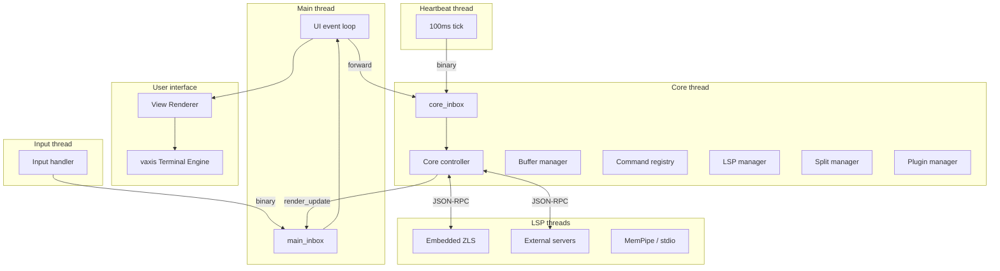
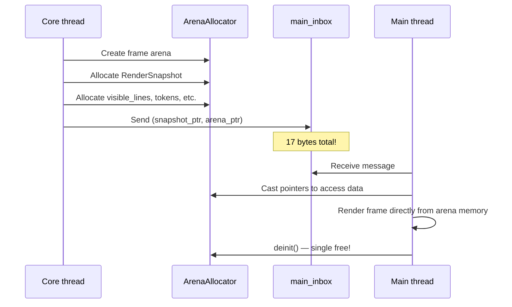
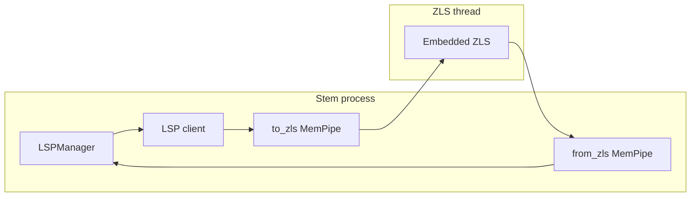
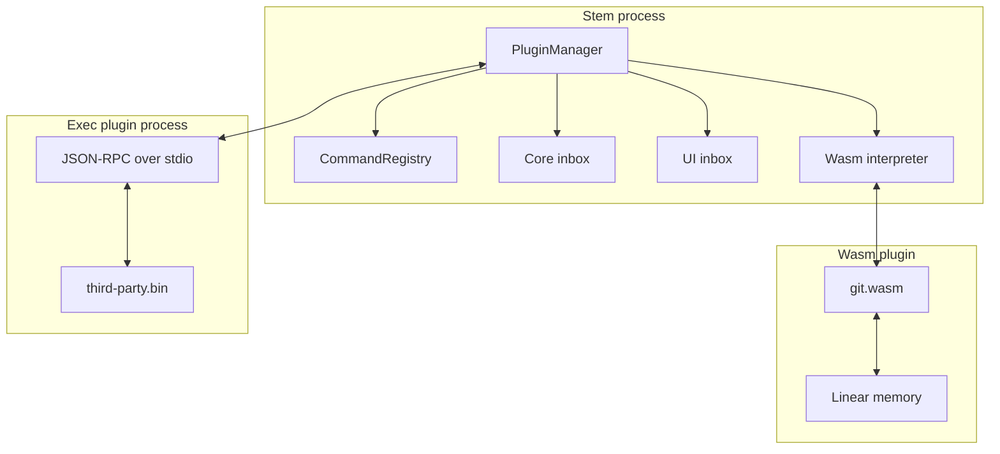

# Stem — Architecture Reference

Long-form notes on how stem fits together. For the source-code map
see the [Developer Guide](dev-guide.md). For the user-facing feature
list see the [README](../README.md).

---

## Contents

- [Architecture overview](#architecture-overview)
- [Binary message protocol](#binary-message-protocol)
- [Kernel internals](#kernel-internals)
- [Rendering pipeline](#rendering-pipeline)
- [UI layer](#ui-layer)
- [Language intelligence (LSP)](#language-intelligence-lsp)
- [Syntax layer (tree-sitter)](#syntax-layer-tree-sitter)
- [Plugin system](#plugin-system)
- [CLI tools](#cli-tools)
- [Editor modes](#editor-modes)
- [Session and recovery](#session-and-recovery)
- [Configuration](#configuration)
- [Project structure](#project-structure)
- [Dependencies and build requirements](#dependencies-and-build-requirements)
- [Contributing](#contributing)

---

## Architecture overview

Stem is a multi-threaded, message-passing editor. Each thread owns
its state and communicates by sending binary-encoded protocol
messages through [`vigil`](https://github.com/ooyeku/vigil) inboxes.



### Thread model

| Thread | Role | Communication |
|---|---|---|
| Main thread (UI) | Render via `vaxis`, manage app lifecycle, process `render_update` messages | Consumes `main_inbox`, forwards input to `core_inbox` |
| Core thread | Text editing logic, buffer management, LSP orchestration, command execution | Consumes `core_inbox`, produces `render_update` to `main_inbox` |
| Input thread | Listens for `vaxis` input events (keyboard, mouse, resize) | Produces to `main_inbox` |
| Heartbeat thread | 100 ms ticks for hover delay, debounced LSP updates, recovery snapshots | Produces to `core_inbox` |
| LSP threads | Per-language server I/O (embedded ZLS plus external child processes) | JSON-RPC over `MemPipe` (ZLS) or stdio (external) |

---

## Binary message protocol

All inter-thread channels carry binary-encoded protocol messages
defined in [`protocol.zig`](../src/kernel/protocol.zig). The compact
encoding keeps the hot path allocation-free.

```zig
pub const Message = union(enum) {
    input: vaxis.Key,
    mouse: vaxis.Mouse,
    command: Command,
    render_update: RenderUpdateMessage,
    resize: vaxis.Winsize,
    mode_change: Mode,
    terminal_execute: []const u8,
    terminal_output_chunk: []const u8,
    terminal_result: TerminalResult,
    quit,
    tick,
};
```

### Wire format

Each message has a fixed-size representation. Examples:

| Message | Tag | Size | Layout |
|---|---|---|---|
| `input` | 0x01 | 6 bytes | `tag(1) + codepoint(4) + mods(1)` |
| `mouse` | 0x02 | 8 bytes | `tag(1) + col(2) + row(2) + button(1) + type(1) + mods(1)` |
| `command` | 0x03 | 2 bytes | `tag(1) + command_id(1)` |
| `render_update` | 0x04 | 17 bytes | `tag(1) + snapshot_ptr(8) + arena_ptr(8)` |
| `resize` | 0x05 | 5 bytes | `tag(1) + rows(2) + cols(2)` |
| `tick` | 0x0A | 1 byte | `tag(1)` |

### Memory ownership

1. `encode()` allocates bytes using the caller's allocator.
2. `Inbox.send()` copies the payload internally.
3. The caller frees the original buffer (`defer allocator.free(bytes)`).
4. The receiver calls `msg.deinit()` to free the inbox's copy.

For render snapshots the message carries a pointer to a per-frame
arena; the receiver renders directly from that arena and the arena
is freed in a single call when the next frame arrives.

---

## Kernel internals

The `src/kernel/` directory contains the core editor state machine.

### Core controller — [`core.zig`](../src/kernel/core.zig)

The `Core` struct is the central orchestrator. Notable fields:

```zig
pub const Core = struct {
    allocator: std.mem.Allocator,
    buffer_manager: BufferManager,
    ui_inbox: *vigil.Inbox,
    core_inbox: ?*vigil.Inbox,

    mode: protocol.Mode,
    version: u64,
    needs_render: bool,

    lsp_manager: LSPManager,
    plugin_manager: PluginManager,
    command_registry: CommandRegistry,
    split_manager: ?SplitManager,
    search_index: SearchIndex,
    // ...
};
```

Key responsibilities:

| Method | Description |
|---|---|
| `run()` | Main event loop processing messages from `core_inbox` |
| `handleKey()` | Keyboard input dispatch based on the active mode |
| `handleMouse()` | Mouse click, scroll, drag handling |
| `sendUpdate()` | Builds a `RenderSnapshot` and posts it to UI |
| `checkHover()` | LSP hover trigger after the idle timer fires |
| `ensureLspDocument()` | Re-syncs the buffer with the LSP on buffer switch |
| `writeRecoverySnapshot()` | Periodic crash-recovery save (every 30 s + on every user save) |

### Buffer management

#### Piece table — [`piece_table.zig`](../src/core/piece_table.zig)

```zig
pub const PieceTable = struct {
    original: []const u8,
    add: std.ArrayListUnmanaged(u8),
    pieces: std.ArrayListUnmanaged(Piece),

    cached_total_len: ?usize,
    cached_line_count: ?usize,
};

pub const Piece = struct {
    source: BufferSource,  // Original or Add
    start: usize,
    length: usize,
};
```

Performance characteristics:

- Insert / delete: typically O(1), worst case O(pieces)
- Rendering: O(visible_lines) — only extracts what's needed
- Memory: efficient for large files with localised edits

Selected methods:

- `getVisibleLines(start, count)` — viewport extraction
- `insert(offset, text)` — split a piece, append to add buffer
- `delete(offset, length)` — adjust piece boundaries
- `toString()` — full reconstruction

#### Editor state — [`state.zig`](../src/core/state.zig)

Wraps a `PieceTable` with viewport, cursor, selection, and file
metadata. Saves are atomic: write to `<path>.tmp`, fsync, rename.

```zig
pub const EditorState = struct {
    allocator: Allocator,
    buffer: PieceTable,

    cursor_row: usize,
    cursor_col: usize,
    scroll_offset: usize,

    file_path: ?[]u8,
    modified: bool,

    selection_anchor: ?struct { row: usize, col: usize },
};
```

Notable helpers:

- `insertNewlineWithIndent()` — auto-indent based on syntax context
- `insertTab()` — configurable tab insertion
- `deleteBackspace()` — bracket-aware backspace
- `duplicateLine()`, `swapAdjacentLines()`, `joinLines()`

#### Buffer manager — [`buffer_manager.zig`](../src/kernel/buffer_manager.zig)

Multi-buffer workflow with tab-style switching:

```zig
pub const BufferManager = struct {
    allocator: std.mem.Allocator,
    buffers: std.ArrayListUnmanaged(Buffer),
    active_index: usize,
};
```

- `nextBuffer()` / `prevBuffer()` — cycle through buffers
- `closeBuffer()` / `closeOthers()` — buffer lifecycle
- `createBuffer()` — new untitled buffer
- `pickerReset()` / `pickerFilter()` — buffer picker integration

### Command registry — [`command.zig`](../src/kernel/command.zig)

A flat command registry with fuzzy search for the palette:

```zig
pub const Command = struct {
    id: []const u8,          // e.g. "file.save"
    title: []const u8,
    description: []const u8,
    execute: CommandFn,
};

pub const CommandRegistry = struct {
    allocator: std.mem.Allocator,
    commands: std.StringHashMap(Command),
};
```

The matcher combines substring search, subsequence scoring (with
consecutive / word-boundary / camelCase bonuses), and word-initials
matching ("gtl" → "Go To Line"). Title matches get a score boost.

### Split manager — [`split_manager.zig`](../src/kernel/split_manager.zig)

Splits are stored as a binary tree:

```zig
pub const SplitNode = union(enum) {
    pane: *Pane,
    container: Container,
};

pub const Container = struct {
    direction: SplitDirection,  // horizontal or vertical
    split_ratio: f32,
    first: *SplitNode,
    second: *SplitNode,
};

pub const Pane = struct {
    id: u32,
    buffer_index: usize,
    cursor_row: usize,
    cursor_col: usize,
    scroll_offset: usize,
};
```

Focus navigation: `focusLeft/Right/Up/Down`. Each pane keeps its
own cursor and scroll state.

### History — [`history.zig`](../src/kernel/history.zig)

Transactional undo / redo with automatic grouping of rapid edits:

```zig
pub const HistoryManager = struct {
    allocator: std.mem.Allocator,
    undo_stack: std.ArrayListUnmanaged(Transaction),
    redo_stack: std.ArrayListUnmanaged(Transaction),
    current_transaction: ?Transaction,
};

pub const Transaction = struct {
    actions: std.ArrayListUnmanaged(HistoryAction),
    cursor_before: CursorState,
    cursor_after: CursorState,
    timestamp: i64,
};
```

- Edits within ~500 ms collapse into a single transaction
- Undo / redo restores the cursor to its original position
- Each action stores the inverse so the reverse is exact
- Max stack size caps memory use

User bindings: `Space u` (undo), `Space r` (redo); palette commands
`edit.undo` and `edit.redo`.

### Virtual file system — [`vfs.zig`](../src/kernel/vfs.zig)

URI-based file abstraction:

```zig
pub const UriScheme = enum {
    file,      // file:///path/to/file.zig
    memory,    // memory://scratch-buffer
    git,       // git://HEAD:path/file.zig
};
```

`memory://` powers virtual buffers (help view, plugin output);
`git://` is reserved for diff views.

### Decorations — [`decorations.zig`](../src/kernel/decorations.zig)

Visual overlay system covering search highlights, matching brackets,
git change markers, LSP diagnostics, and build errors. Decorations
have a priority (for layering), a kind (drives gutter vs inline
rendering), an optional tooltip, and a source string (for bulk-clear
by source).

### Job manager — [`jobs.zig`](../src/kernel/jobs.zig)

Cancellable background tasks with progress tracking. Each job runs
on its own thread with atomic status updates the UI can observe.

User binding: `Space j` opens the active-job list. Palette command:
`job.list`.

### Workspace — [`workspace.zig`](../src/kernel/workspace.zig)

Zig project detection: walks up the tree looking for `build.zig`,
attaches each buffer to its detected workspace, and feeds the
workspace root to the LSP on buffer switch.

### Bookmarks — [`bookmarks.zig`](../src/kernel/bookmarks.zig)

26-slot per-project mark store keyed by `a–z`. `m<x>` from Select
mode writes `(file, row, col)` to slot `x`; `'<x>` jumps. Slots
persist under `~/.stem/cache/bookmarks/<project-hash>.json`. The
`[Bookmarks]` virtual buffer (palette `bookmark.list`) shows every
set slot; `bookmark.clear_all` wipes the project.

### Jump list — [`jump_list.zig`](../src/kernel/jump_list.zig)

100-entry bounded back/forward history. Every cross-buffer
navigation (buffer picker, `Cmd+[/]`, file explorer, virtual buffer
open, bracket match `%`, LSP go-to-definition, symbol pickers,
references / diagnostics pickers) records the cursor before moving.
`Space ,` / `Space .` walk it; `Ctrl+O` / `Ctrl+I` are vim-style
aliases. Buffer entries that share `(file, row, col)` with the
existing tip collapse so repeated motion doesn't pollute history.

### File explorer — [`file_explorer.zig`](../src/kernel/file_explorer.zig)

Tree-shaped modal file opener rooted at the workspace cwd. Flat
visible-row list rebuilt on expand/collapse; persistent
`expanded: StringHashMap` set lets the tree remember its shape
across re-opens within a session. Reachable via `Space e`, the
universal `Cmd+O`, or the palette `file.open` — all three are
aliases for the same entry point.

### Build integration — [`build_jobs.zig`](../src/kernel/build_jobs.zig)

Runs `zig build`, `zig build test`, etc., parses compiler
diagnostics, and surfaces errors as decorations over open files.

Palette commands:

| Command | Description |
|---|---|
| `Zig: Build` | `zig build` |
| `Zig: Test` | `zig build test` |
| `Zig: Show Build Output` | view last result |

### Global search — [`global_search.zig`](../src/services/global_search.zig)

Project-wide grep with parallel per-file scan. Phase 1 walks the
file tree (or consumes the pre-built path list from the search
index); phase 2 fan-outs the scan across `std.Thread.Pool` workers.
Auto-excluded directories include `.git`, `node_modules`,
`zig-cache`, `zig-out`, plus a dozen other tooling caches.

In-mode key bindings:

| Key | Action |
|---|---|
| `Tab` | Toggle case sensitivity |
| Up / Down | Navigate files / matches |
| Enter | Jump to selected match |
| Esc | Exit search mode |

### Search index — [`search_index.zig`](../src/services/search_index.zig)

A persistent, in-memory list of the workspace's text-file paths.
Eliminates the directory walk on every `:Find` query — once the
index is warm, queries skip straight to the parallel scan. Persisted
across restarts in
`~/.stem/cache/search/<workspace-hash>.lst` so even the first query
in a new session is warm. The cache file carries a header tagged
with the absolute workspace root; mismatches are rejected.

---

## Rendering pipeline

### Zero-copy snapshots

The core thread builds each render snapshot inside a per-frame
arena. The protocol message only carries two pointers (snapshot and
arena), so the UI thread reads the snapshot in place and frees the
whole arena in a single call when it's done.



### `RenderSnapshot`

```zig
pub const RenderSnapshot = struct {
    // Text content
    visible_lines: []const []const u8,
    first_visible_line: usize,
    total_lines: usize,

    // Cursor & selection
    cursor_row: usize,
    cursor_col: usize,
    selection_anchor_row: ?usize,
    selection_anchor_col: ?usize,

    // UI state
    mode: Mode,
    file_path: ?[]const u8,
    terminal_output: ?[]const u8,

    // Syntax + LSP overlays
    syntax_tokens: ?[]const SyntaxToken,
    hover_document: ?HoverDocument,
    hover_anchor_row: usize,
    hover_anchor_col: usize,
    signature_help_label: ?[]const u8,
    signature_help_parameters: ?[]const Range,
    signature_help_active_parameter: ?u32,
    inlay_hints: ?[]const InlayHintSnapshot,
    diagnostics: ?[]const DiagnosticSnapshot,
    diagnostic_error_count: u32,
    diagnostic_warning_count: u32,

    // Completion
    completion_active: bool,
    completion_items: ?[]const CompletionEntry,

    // Pickers (mode-specific payloads)
    file_picker_entries: ?[]const DirEntry,
    file_explorer_entries: ?[]const ExplorerEntry,
    buffer_picker_selected: usize,
    command_palette_results: ?[]const CommandEntry,
    symbol_picker_results: ?[]const SymbolEntry,
    workspace_symbol_results: ?[]const WorkspaceSymbolEntry,
    references_entries: ?[]const ReferenceEntry,
    diagnostics_entries: ?[]const DiagnosticPickerEntry,
    global_search_results: ?[]const GlobalSearchFileGroup,

    // Which-key
    which_key_visible: bool,

    // Split layout
    split_enabled: bool,
    panes: []const PaneSnapshot,
    focused_pane_id: u32,

    // Misc
    git_branch: ?[]const u8,
    active_job_count: u32,
    status_message: ?[]const u8,
    status_message_level: StatusLevel,
};
```

### Frame pacing

- 60 Hz cap: `sendUpdate` throttles itself when the previous render
  was less than ~16 ms ago, setting `needs_render = true` so the
  tick handler can fire the deferred render once the gate elapses.
- `needs_render` coalesces redundant updates between input bursts
  and tick wake-ups.
- Single allocation / deallocation per render cycle (arena pool).
- `O(visible_lines)` extraction from the piece table.
- `buffer.toString()` is memoised per-frame in the hot path so the
  syntax + brackets + LSP work for one frame all share one
  reconstruction.

---

## UI layer

### Main view — [`view.zig`](../src/ui/view.zig)

The view is stateless — every frame is drawn from the snapshot.
Features include soft wrapping driven by viewport width, syntax
highlighting overlays from the tokens in the snapshot, selection /
cursor rendering keyed to the current mode, and defensive guards
against malformed snapshots (zero-size windows, oversized line
counts, mid-codepoint slices).

### Popups & pickers

| Popup | Function | Notes |
|---|---|---|
| Hover | `drawHoverPopup` | Markdown-rendered, anchored near cursor, idle-auto or sticky (`Space l h`) |
| Signature help | `drawSignatureHelp` | One-line popup above the cursor; active parameter bolded |
| Inlay hints | inline in `draw` | Dim italic virtual text at LSP-specified positions |
| Completion | `drawCompletionPopup` | Scrollable list with kind icons |
| Which-key | `drawWhichKey` | Top-level expands every chord; capped at ~80% viewport |
| Command palette | `drawCommandPalette` | Fuzzy input + filtered results |
| File explorer | `drawFileExplorer` | Tree-shaped modal, j/k navigate, h/l expand/collapse |
| References / diagnostics picker | `drawReferencesPicker` / `drawDiagnosticsPicker` | Shared `drawModalList` chrome; Esc restores the trigger position |
| Buffer picker | `drawBufferPicker` | Modified marker + number prefix shortcuts |

### Status bar — [`status_bar.zig`](../src/ui/status_bar.zig)

Single-line strip showing mode, file path + modified marker, cursor
position, and mode-specific keyboard hints. The bundled git plugin
populates a `Git: <branch>` indicator via event subscriptions.

### Theme — [`theme.zig`](../src/ui/theme.zig)

One Dark-inspired palette. Colours grouped by category (syntax,
diff, terminal palette) and styles by element (mode indicators,
status bar, tab bar, picker, editor, split borders).

### Logger — [`logger.zig`](../src/services/logger.zig)

Rolling file log under `~/.stem/logs/stem-*.log`. All `std.log`
output is bridged into the file. CLI: `stem logs`, `stem logs
--clear`. In-editor view: `:logs`.

---

## Language intelligence (LSP)

Stem ships ZLS embedded (in-process) for Zig and integrates with 23
external language servers installed on demand via `stem lsp install`.
See the [README table](../README.md#language-coverage) for the full
list.

### Embedded ZLS



The in-memory pipe ([`transport.zig`](../src/lsp/transport.zig))
replaces TCP / stdio for the embedded case so there's no kernel
round-trip on every JSON-RPC frame.

### External servers

External servers are spawned as child processes through
[`external.zig`](../src/services/lsp/external.zig). Each spawned
PID is registered in a process-wide kill registry; on stem's quit
path the registry is drained with `SIGKILL` so the editor never
sits waiting on a misbehaving server.

The installer ([`installer.zig`](../src/services/lsp/installer.zig))
knows how to install each supported server in the user's local
toolchain (npm, go install, rustup, brew, gem, opam, etc.). Once
installed they live under `~/.stem/lsp/<server>/`.

### LSP manager — [`lsp_manager.zig`](../src/services/lsp_manager.zig)

Owns per-language server lifecycles, routes incoming results back to
the core thread, and debounces outbound `didChange` notifications so
typing doesn't flood the server. Per-buffer `version` numbers keep
each request anchored to a specific snapshot.

Wired features:

| Feature | LSP method | Stem integration |
|---|---|---|
| Auto-completion | `textDocument/completion` | Popup with filtered results |
| Hover docs | `textDocument/hover` | Popup at cursor after idle delay; `Space l h` for sticky |
| Signature help | `textDocument/signatureHelp` | Auto-fires in Insert mode on `(` / `,`; active-param highlighted |
| Semantic tokens | `textDocument/semanticTokens/full` | Highlighting overlay |
| Inlay hints | `textDocument/inlayHint` | Virtual italic text for visible range; toggle `Space l i` |
| Formatting (doc) | `textDocument/formatting` | `Space l f`; auto-runs on save when `editor.format_on_save = true` |
| Formatting (range) | `textDocument/rangeFormatting` | `Space l F`; falls back to whole-doc when unsupported |
| Code actions | `textDocument/codeAction` | `Space a` / `Space l a`; digit picker if multiple actions |
| Go to definition | `textDocument/definition` | `Space l d` — records a jump first |
| Find references | `textDocument/references` | `Space l r` opens the references picker |
| Document symbols | `textDocument/documentSymbol` | `Space l s` symbol picker |
| Workspace symbols | `workspace/symbol` | `Space l S` workspace picker |
| Diagnostics (publish) | `textDocument/publishDiagnostics` | Gutter signs, error-lens inline text, picker via `Space l D` |
| Rename | `textDocument/rename` | `Space l R` cross-file rename |

`textDocument/didChange` is sent on a 50 ms trailing-edge debounce so
fast typing collapses into a single notification per server.

---

## Syntax layer (tree-sitter)

Stem integrates tree-sitter for fast, structural analysis across all
supported languages. Tree-sitter complements the LSP: LSP gives deep
semantic answers, tree-sitter gives immediate syntactic ones used
for highlighting, navigation, indentation, and folding.

### Syntax manager — [`manager.zig`](../src/syntax/manager.zig)

```zig
pub const SyntaxManager = struct {
    allocator: std.mem.Allocator,
    parser: *c.TSParser,
    tree: ?*c.TSTree,
    language: ?*const c.TSLanguage,
    query: ?*c.TSQuery,
    cursor: *c.TSQueryCursor,
    current_lang: Language,
};
```

Parses run on a background worker (`submitParse`). The core thread
polls a `tree_updated` flag on tick and triggers a re-render when a
new tree lands — so typing is never blocked on parsing, even for
big files.

### Highlight + bracket caches

Highlight and bracket-matching results are memoised under the
current resource id. The bracket cache is also invalidated on every
recorded edit so a same-length find/replace (`foo` → `bar`) never
serves stale positions.

### Features

- `highlight(start_line, end_line)` — viewport-scoped token list
- `getSymbols(source)` — fast in-file symbol navigation
- `expandSelection()` — grow selection to the next syntactic boundary
  (powers `nav.expand_selection` and the `V` key)
- `getSmartIndent(line)` — language-aware indent
- `getFoldableRegions()` — collapsible regions for fold rendering
- `applyIncrementalEdit()` — feed edit deltas to tree-sitter so the
  reparse is incremental

### Queries

Tree-sitter `.scm` files live under
[`src/syntax/queries/`](../src/syntax/queries/) — one per language.

---

## Plugin system

Stem has a manifest-driven plugin system. Plugins live in
`~/.stem/plugins/<name>/`, declare commands and permissions in
`plugin.json`, and run through either the `wasm` or `exec` runtime.
See [plugins.md](plugins.md) for the full author guide and host
internals.

### Architecture



### Key components

- **Manifest loading.** Auto-discovers `~/.stem/plugins/<name>/plugin.json`
  on startup and seeds commands into the palette before runtime
  activation.
- **Isolation.** Wasm plugins run inside the pure-Zig interpreter
  with `(ptr, len)` host imports; exec plugins run as child
  processes communicating over framed JSON-RPC on stdio.
- **Permissions.** Manifest declarations gate the wired capabilities
  (`spawn`, `events`, `manage_plugins`). Missing entries default to
  deny.
- **Restart policy.** Exec plugins can opt into automatic restart on
  crash with a 1 s → 5 s → 30 s backoff. Restarts run on the core
  tick so spawns never originate from a reader thread that's still
  unwinding.

### Bundled plugins

| Plugin | Runtime | Commands |
|---|---|---|
| `echo` | wasm | `echo.hello` |
| `git` | wasm | `git.status`, `git.diff`, `git.diff_staged` |
| `plugin_manager` | wasm | `plugin-manager.stats`, `plugin-manager.reload_all`, `plugin.load`, `plugin.unload` |

### Operator CLI

```bash
stem plugin list
stem plugin info <name>
stem plugin install <path>
stem plugin remove <name>
stem plugin test <path>
```

---

## CLI tools

```bash
stem [filename]
stem --find "query"  [options]
stem --vfind "query" [options]
stem --scope FILE QUERY
```

| Option | Short | Description |
|---|---|---|
| `--path` | `-p` | Search directories (multiple allowed) |
| `--ext` | `-e` | File extensions (default: `.zig`) |
| `--exclude` | `-x` | Exclude patterns |
| `--after` | `-A` | Context lines after match |
| `--before` | `-B` | Context lines before match |

Implementations:

| Tool | Implementation | Concurrency |
|---|---|---|
| `--find` | [search.zig](../src/tools/search.zig) | `std.Thread.Pool` (work-stealing) |
| `--vfind` | [vfind.zig](../src/tools/vfind.zig) | Vigil actor model (inbox-based) |
| `--scope` | [scope.zig](../src/tools/scope.zig) | In-file search |

`--find` is the workhorse; `--vfind` is the interactive variant
backed by an actor pipeline.

---

## Editor modes

| Mode | Entry | Description |
|---|---|---|
| `select` | default | Navigation, selection, leader chord dispatch |
| `insert` | `i` | Text input; auto-pair, signature help on `(` / `,` |
| `visual` | `v` | Visual selection (text objects via `i <c>` / `a <c>`) |
| `visual_search` | `/` (forward), `?` (backward) | Incremental in-buffer search with live highlights |
| `terminal` | `t` | Integrated terminal |
| `file_explorer` | `Space e` | Tree-shaped modal file opener — *single canonical entry point* |
| `file_picker` | palette `file.open` only | Legacy directory-listing picker (kept reachable from the palette) |
| `buffer_picker` | `Space b` | Buffer switcher |
| `command_palette` | `Space f` (or `Space :` on terminals that handle Shift+; cleanly) | Fuzzy command search |
| `references_picker` | `Space l r` | LSP references; Enter jumps + records, Esc restores trigger |
| `diagnostics_picker` | `Space l D` | LSP diagnostics; same picker UX |
| `symbol_picker` | `Space l s` | Document symbols |
| `workspace_symbol_picker` | `Space l S` | Workspace-wide symbol search |
| `go_to_line` | palette | Line number input |
| `save_as_mode` | palette | Save with new name |
| `log_view` | palette `system.logs` | Runtime log viewer |
| `global_search` | `Space /` | Project-wide search + replace-with-confirmation walk |
| `view` | `Space h` | Help / docs view |

### Leader chord groups

The Space leader supports four chord prefixes; the next key picks
the sub-action. The which-key popup expands every chord inline at
the top level so the sub-bindings are discoverable without entering
the chord.

| Chord | Family | Sample bindings |
|---|---|---|
| `Space l` | LSP | `d` definition · `r` references · `h` hover · `a` code actions · `f` / `F` format buffer / selection · `D` diagnostics · `s` / `S` doc / workspace symbols · `R` rename · `t` toggle inline diagnostics · `i` toggle inlay hints · `=` toggle format-on-save |
| `Space g` | Git | `d` diff |
| `Space w` | Window / splits | `-` horizontal · `\|` vertical · `h/j/k/l` focus · `q` close pane |
| `Space t` | Editor toggles | `d` inline diagnostics · `i` inlay hints · `=` format-on-save |

### Jump-list navigation

`Space ,` / `Space .` (and the vim aliases `Ctrl+O` / `Ctrl+I`) walk the
back/forward jump list. Every cross-buffer navigation (`Space b`,
`Space e`, `Cmd+[/]`, picker open, bracket match `%`, symbol picker,
LSP go-to-definition, virtual-buffer open) records the cursor before
moving, so the user can always get back. The references and
diagnostics pickers additionally stash the trigger location into the
virtual buffer's `opened_from` field so `Esc` returns the cursor
exactly to where the picker was opened from.

For the full key map see the
[README](../README.md#key-bindings).

---

## Session and recovery

Stem auto-saves per-workspace session state — open buffers, cursor
positions, scroll offsets, and split layouts. Sessions live under
`~/.stem/sessions/<workspace-hash>.json`.

A second snapshot at `<session>.recover` is written on every save
plus every 30 s of activity. On clean shutdown this recovery file is
deleted; if stem finds it at launch the previous run crashed and the
file is used to restore state. Each save is atomic (write to
`.tmp`, fsync, rename) so a crash mid-write can never produce a
zero-byte session file.

### Auto-save buffer backups

Independent of the session file, every dirty buffer is snapshotted
to `~/.stem/recover/<hash>.bak` (with a `.path` sidecar listing the
source path) every `editor.auto_save_interval_seconds` (default 30).
On startup the recovery scanner surfaces backups whose source is
older than the snapshot; `buffer.restore_backups` (palette) opens
the `[Recovery Backups]` index for selective restore. Disable
entirely with `editor.auto_save_backup = false`.

### Crash dump

The Zig panic handler installed in `main.zig` writes
`~/.stem/crash/<timestamp>.txt` with the stack trace, recent log
tail, open buffer list (with dirty flags), and version info before
re-raising. Combined with the auto-save backups above this means an
unexpected exit doesn't lose work and is debuggable from the
artefact alone.

---

## Configuration

`~/.stem/config.json`, created on first run:

```json
{
    "theme": "default",
    "editor": {
        "tab_size": 4,
        "insert_spaces": true,
        "line_numbers": "relative",
        "wrap": false,
        "mouse_enabled": true,
        "auto_pairs": true,
        "cursor_line": true,
        "format_on_save": false,
        "inline_diagnostics": true,
        "inlay_hints": false,
        "auto_save_backup": true,
        "auto_save_interval_seconds": 30,
        "large_file_threshold_bytes": 5242880,
        "large_file_threshold_lines": 50000,
        "large_file_hard_limit_bytes": 104857600
    },
    "ui": {
        "show_status_bar": true
    },
    "logging": {
        "level": "info"
    }
}
```

Editor knobs:

| Key | Default | Effect |
|---|---|---|
| `format_on_save` | `false` | Run LSP `textDocument/formatting` before each save |
| `inline_diagnostics` | `true` | Error-lens at end-of-line on every affected line |
| `inlay_hints` | `false` | Render LSP inlay hints as dim italic virtual text |
| `auto_save_backup` | `true` | Periodic `.bak` snapshots under `~/.stem/recover/` |
| `auto_save_interval_seconds` | `30` | Cadence for the auto-save sweep |
| `large_file_threshold_bytes` | `5242880` (5 MB) | Soft threshold — past this, tree-sitter / brackets / LSP / auto-pair are disabled for the buffer; `[LARGE]` badge in status bar |
| `large_file_threshold_lines` | `50000` | Soft threshold by line count |
| `large_file_hard_limit_bytes` | `104857600` (100 MB) | Hard limit — buffers larger than this are rejected at open |

Logging levels: `debug`, `info`, `warn`, `err`.

### CLI

```bash
stem config list
stem config get editor.tab_size
stem config set editor.tab_size 2
stem config set ui.show_status_bar false
stem config set editor.line_numbers absolute
stem config set logging.level debug

stem logs
stem logs --clear

stem help
stem --help
stem --version
```

Logs land at `~/.stem/logs/stem-*.log`.

---

## Project structure

```
stem/
├── src/
│   ├── main.zig
│   ├── cli.zig
│   ├── kernel/
│   │   ├── core.zig
│   │   ├── protocol.zig
│   │   ├── command.zig
│   │   ├── commands/                 # buffer/edit/file/git/lsp/nav/split/system/build/plugin
│   │   ├── arena_pool.zig
│   │   ├── bookmarks.zig
│   │   ├── buffer_manager.zig
│   │   ├── decorations.zig
│   │   ├── file_explorer.zig
│   │   ├── filetype.zig
│   │   ├── history.zig
│   │   ├── jobs.zig
│   │   ├── jump_list.zig
│   │   ├── message_bus.zig
│   │   ├── platform.zig
│   │   ├── request_reply.zig
│   │   ├── safe.zig
│   │   ├── session.zig
│   │   ├── split_manager.zig
│   │   ├── terminal_proc.zig
│   │   ├── workspace.zig
│   │   ├── build_jobs.zig
│   │   └── vfs.zig
│   ├── core/
│   │   ├── piece_table.zig
│   │   ├── state.zig
│   │   ├── file_manager.zig
│   │   ├── unicode.zig
│   │   └── auto_pair.zig
│   ├── ui/
│   │   ├── view.zig
│   │   ├── status_bar.zig
│   │   ├── tab_bar.zig
│   │   ├── file_picker.zig
│   │   ├── buffer_picker.zig
│   │   ├── which_key.zig
│   │   ├── width.zig
│   │   ├── help.zig
│   │   ├── help_view.zig
│   │   ├── log_view.zig
│   │   └── theme.zig
│   ├── lsp/
│   │   ├── client.zig
│   │   └── transport.zig
│   ├── services/
│   │   ├── lsp_manager.zig
│   │   ├── global_search.zig
│   │   ├── search_index.zig
│   │   ├── hover_doc.zig
│   │   ├── logger.zig
│   │   ├── telemetry.zig
│   │   ├── terminal.zig
│   │   ├── thread_name.zig
│   │   └── lsp/
│   │       ├── external.zig
│   │       ├── installer.zig
│   │       ├── server.zig
│   │       ├── supervisor.zig
│   │       └── zls_embedded.zig
│   ├── plugins/
│   │   ├── manager.zig
│   │   ├── manifest.zig
│   │   ├── process_loader.zig
│   │   ├── jsonrpc.zig
│   │   ├── inspect.zig
│   │   └── wasm/
│   │       ├── interpreter.zig
│   │       └── loader.zig
│   ├── tools/
│   │   ├── search.zig
│   │   ├── vfind.zig
│   │   ├── scope.zig
│   │   ├── format.zig
│   │   ├── query_check.zig
│   │   └── plugin_cli.zig
│   ├── syntax/
│   │   ├── manager.zig
│   │   ├── tree_sitter.zig
│   │   └── queries/
│   ├── config/
│   │   ├── keys.zig
│   │   ├── schema.zig
│   │   └── storage.zig
│   └── fuzz/
│       ├── mod.zig
│       ├── piece_table_fuzz.zig
│       ├── editor_state_fuzz.zig
│       ├── config_setbypath_fuzz.zig
│       ├── lsp_json_fuzz.zig
│       └── uri_fuzz.zig
├── bundled/plugins/
├── docs/
├── scripts/
├── build.zig
└── build.zig.zon
```

---

## Dependencies and build requirements

| Dependency | Purpose | Integration |
|---|---|---|
| [vaxis](https://github.com/rockorager/libvaxis) | Terminal UI engine | Direct rendering |
| [vigil](https://github.com/ooyeku/vigil) | Actor-style message passing | Thread communication |
| [zls](https://github.com/zigtools/zls) | Zig Language Server | Embedded, in-process |
| [lsp-kit](https://github.com/zigtools/lsp-kit) | LSP protocol types | Shared with ZLS |
| [uucode](https://github.com/jacobsandlund/uucode) | Unicode tables | Width / case folding |
| [tree-sitter](https://github.com/tree-sitter/tree-sitter) | Parser core + grammars | Syntax / nav |

Build requirements:

- Zig 0.16+
- POSIX-like host (macOS, Linux). Windows is experimental.

### Fuzz testing

Fuzz targets in [src/fuzz/](../src/fuzz/) cover the piece table,
editor state, URI parser, JSON LSP messages, and the
`config.setByPath` API.

```bash
zig build fuzz                   # macOS
zig build test --fuzz            # Linux
```

---

## Contributing

1. Fork the repository
2. Create a feature branch
3. Add tests where it makes sense; keep `zig build` and
   `zig build test` green
4. Cross-check at least one other target with
   `-Dtarget=x86_64-linux-gnu`
5. Open a pull request

Code style:

- Follow `zig fmt`
- Use `std.log.scoped` for module-level logging
- Validate at boundaries (user input, external APIs); trust
  internal callers
- Comment the *why*, not the *what* — well-named identifiers cover
  the latter
