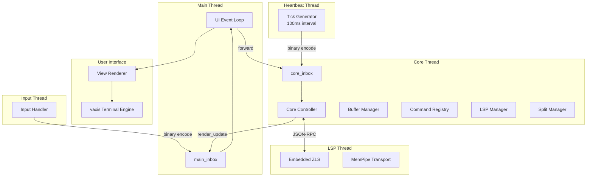
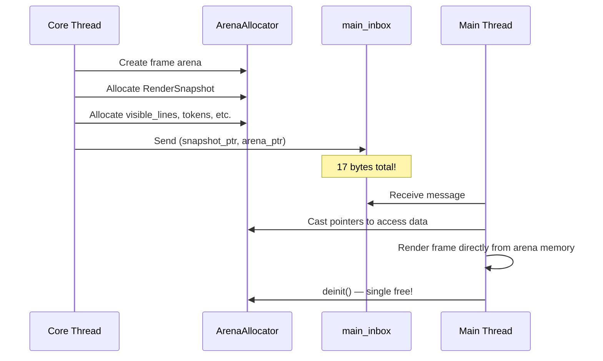
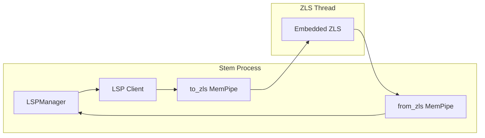
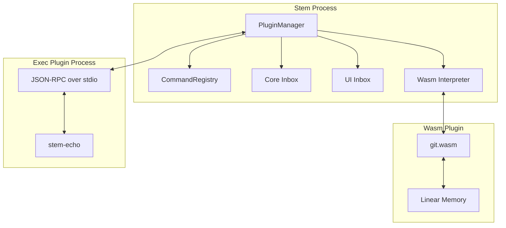
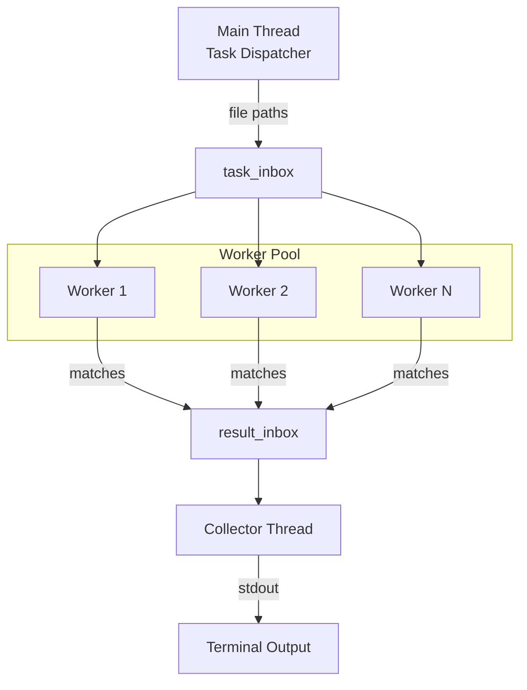

# Stem Editor

**Yet Another Powerful** text editor — built in Zig for speed, extensibility, and a smooth terminal experience.

---

## Architecture Overview

Stem employs a **multi-threaded, message-passing architecture** that cleanly decouples UI rendering, input handling, and text processing. This design enables high performance, eliminates UI jank, and provides a solid foundation for extensibility.



### Thread Model

| Thread | Role | Communication |
|--------|------|---------------|
| **Main Thread (UI)** | Renders via `vaxis`, manages app lifecycle, processes `render_update` messages | Consumes from `main_inbox`, forwards input to `core_inbox` |
| **Core Thread (Kernel)** | Text editing logic, buffer management, LSP orchestration, command execution | Consumes from `core_inbox`, produces `render_update` to `main_inbox` |
| **Input Thread** | Listens for `vaxis` input events (keyboard, mouse, resize) | Produces to `main_inbox` |
| **Heartbeat Thread** | Generates tick events every 100ms for hover, polling, animations | Produces to `core_inbox` |
| **LSP Thread** | Runs embedded Zig Language Server | Communicates via `MemPipe` with `LSPManager` |

---

## Binary Message Protocol

Stem uses a **compact binary protocol** for inter-thread communication, replacing traditional JSON serialization for maximum performance.

### Protocol Definition ([protocol.zig](file:///src/kernel/protocol.zig))

```zig
pub const Message = union(enum) {
    input: vaxis.Key,           // Keyboard input
    mouse: vaxis.Mouse,         // Mouse events
    command: Command,           // Command execution
    render_update: RenderUpdateMessage,  // UI update
    resize: vaxis.Winsize,      // Terminal resize
    mode_change: Mode,          // Editor mode switch
    terminal_execute: []const u8,
    terminal_output_chunk: []const u8,
    terminal_result: TerminalResult,
    quit,
    tick,                       // Heartbeat tick
};
```

### Binary Encoding Format

Each message type has a fixed-size binary representation:

| Message Type | Tag | Size | Layout |
|-------------|-----|------|--------|
| `input` | 0x01 | 6 bytes | `tag(1) + codepoint(4) + mods(1)` |
| `mouse` | 0x02 | 8 bytes | `tag(1) + col(2) + row(2) + button(1) + type(1) + mods(1)` |
| `command` | 0x03 | 2 bytes | `tag(1) + command_id(1)` |
| `render_update` | 0x04 | 17 bytes | `tag(1) + snapshot_ptr(8) + arena_ptr(8)` |
| `resize` | 0x05 | 5 bytes | `tag(1) + rows(2) + cols(2)` |
| `tick` | 0x0A | 1 byte | `tag(1)` |

### Memory Management

The protocol uses explicit memory ownership:
1. `encode()` allocates bytes using the provided allocator
2. The `Inbox.send()` copies the payload internally
3. **Caller must free** the original bytes after sending (via `defer allocator.free(bytes)`)
4. Receiver calls `msg.deinit()` to free the inbox's copy

---

## Kernel Architecture

The `src/kernel/` directory contains the core business logic.

### Core Controller ([core.zig](file:///src/kernel/core.zig))

The `Core` struct (3900+ LOC) is the central controller orchestrating all editor functionality.

```zig
pub const Core = struct {
    allocator: std.mem.Allocator,
    buffer_manager: BufferManager,
    ui_inbox: *vigil.Inbox,
    core_inbox: ?*vigil.Inbox,
    
    // Editor State
    mode: protocol.Mode,
    version: u64,
    needs_render: bool,
    
    // Services
    lsp_manager: LSPManager,
    command_registry: CommandRegistry,
    split_manager: ?SplitManager,
    
    // ...
};
```

**Key Responsibilities:**

| Function | Description |
|----------|-------------|
| `run()` | Main event loop processing messages from `core_inbox` |
| `handleKey()` | Keyboard input dispatch based on current mode |
| `handleMouse()` | Mouse click, scroll, and drag handling |
| `sendUpdate()` | Creates `RenderSnapshot` and sends to UI |
| `checkHover()` | Triggers LSP hover after 150ms delay |
| `ensureLspDocument()` | Syncs buffer state with LSP on buffer switch |

### Buffer Management

#### PieceTable ([piece_table.zig](file:///src/core/piece_table.zig))

The underlying data structure for text storage, optimized for efficient edits.

```zig
pub const PieceTable = struct {
    original: []const u8,      // Original file content (immutable)
    add: std.ArrayListUnmanaged(u8),  // Append-only add buffer
    pieces: std.ArrayListUnmanaged(Piece),  // Piece descriptors
    
    // Cached stats (invalidated on edit)
    cached_total_len: ?usize,
    cached_line_count: ?usize,
};

pub const Piece = struct {
    source: BufferSource,  // Original or Add
    start: usize,
    length: usize,
};
```

**Performance Characteristics:**
- Insert/Delete: O(pieces) in worst case, typically O(1)
- Rendering: O(visible_lines) — only extracts what's needed
- Memory: Efficient for large files with localized edits

**Key Methods:**
- `getVisibleLines(start, count)` — O(visible) line extraction
- `insert(offset, text)` — Splits pieces, appends to add buffer
- `delete(offset, length)` — Adjusts piece boundaries
- `toString()` — Full content reconstruction

#### EditorState ([state.zig](file:///src/core/state.zig))

Wraps a `PieceTable` with cursor, viewport, and selection state.

```zig
pub const EditorState = struct {
    allocator: Allocator,
    buffer: PieceTable,
    
    // Viewport State
    cursor_row: usize,
    cursor_col: usize,
    scroll_offset: usize,
    
    // File State
    file_path: ?[]u8,
    modified: bool,
    
    // Selection
    selection_anchor: ?struct { row: usize, col: usize },
};
```

**Smart Editing Features:**
- `insertNewlineWithIndent()` — Auto-indentation based on context
- `insertTab()` — 4-space tab insertion
- `deleteBackspace()` — Smart backspace with bracket handling
- `duplicateLine()`, `swapAdjacentLines()`, `joinLines()` — Line operations

#### BufferManager ([buffer_manager.zig](file:///src/kernel/buffer_manager.zig))

Manages multiple open buffers with tab-style switching.

```zig
pub const BufferManager = struct {
    allocator: std.mem.Allocator,
    buffers: std.ArrayListUnmanaged(Buffer),
    active_index: usize,
};
```

**Operations:**
- `nextBuffer()` / `prevBuffer()` — Cycle through buffers
- `closeBuffer()` / `closeOthers()` — Buffer lifecycle
- `createBuffer()` — New untitled buffer
- `pickerReset()` / `pickerFilter()` — Buffer picker integration

### Command System ([command.zig](file:///src/kernel/command.zig))

A registry-based command system with fuzzy search for the command palette.

```zig
pub const Command = struct {
    id: []const u8,          // "file.save"
    title: []const u8,       // "Save File"
    description: []const u8, // "Save the current file to disk"
    execute: CommandFn,      // Function pointer
};

pub const CommandRegistry = struct {
    allocator: std.mem.Allocator,
    commands: std.StringHashMap(Command),
};
```

**Fuzzy Search Algorithm:**

The `search()` function implements a sophisticated multi-strategy fuzzy matcher:

1. **Substring Match** (highest priority) — Case-insensitive exact substring
2. **Subsequence Match** — Characters in order with scoring bonuses:
   - Consecutive matches: +5 points
   - Word boundary matches: +15 points
   - CamelCase matches: +10 points
3. **Word Initials** — "gtl" matches "Go To Line"

Results are sorted by score descending, with title matches receiving a +50 boost.

### Split Manager ([split_manager.zig](file:///src/kernel/split_manager.zig))

Manages split pane layouts using a tree structure.

```zig
pub const SplitNode = union(enum) {
    pane: *Pane,
    container: Container,
};

pub const Container = struct {
    direction: SplitDirection,  // horizontal or vertical
    split_ratio: f32,           // 0.0-1.0 divider position
    first: *SplitNode,
    second: *SplitNode,
};

pub const Pane = struct {
    id: u32,
    buffer_index: usize,
    cursor_row: usize,
    cursor_col: usize,
    scroll_offset: usize,
    // ...
};
```

**Features:**
- Horizontal (left|right) and vertical (top/bottom) splits
- Focus navigation: `focusLeft()`, `focusRight()`, `focusUp()`, `focusDown()`
- Per-pane cursor and scroll state
- Recursive bounds calculation for rendering

### History Manager (Undo/Redo) ([history.zig](file:///src/kernel/history.zig))

Transactional undo/redo system with automatic grouping of rapid edits.

```zig
pub const HistoryManager = struct {
    allocator: std.mem.Allocator,
    undo_stack: std.ArrayListUnmanaged(Transaction),
    redo_stack: std.ArrayListUnmanaged(Transaction),
    current_transaction: ?Transaction,
    
    pub fn undo(self: *HistoryManager) ?Transaction;
    pub fn redo(self: *HistoryManager) ?Transaction;
    pub fn recordInsert(self: *HistoryManager, pos: usize, len: usize) !void;
    pub fn recordDelete(self: *HistoryManager, pos: usize, text: []const u8) !void;
};

pub const Transaction = struct {
    actions: std.ArrayListUnmanaged(HistoryAction),
    cursor_before: CursorState,
    cursor_after: CursorState,
    timestamp: i64,
};
```

**Features:**
- **Transaction Grouping** — Rapid edits (within 500ms) are grouped into single undo operations
- **Cursor Restoration** — Undo/redo restores cursor to original position
- **Inverse Operations** — Records the inverse of each edit for precise undo
- **Max Stack Size** — Limits undo history to prevent memory bloat (1000 transactions)

**Usage:**
- `Space + u` — Undo last change
- `Space + r` — Redo last undone change
- Command palette: `edit.undo`, `edit.redo`

### Virtual File System ([vfs.zig](file:///src/kernel/vfs.zig))

URI-based file abstraction supporting multiple schemes.

```zig
pub const VirtualUri = struct {
    scheme: UriScheme,
    path: []const u8,
    
    pub fn parse(uri_string: []const u8) VirtualUri;
};

pub const UriScheme = enum {
    file,      // file:///path/to/file.zig
    memory,    // memory://scratch-buffer
    git,       // git://HEAD:path/file.zig (future)
};

pub const VirtualFileSystem = struct {
    pub fn read(self: *VirtualFileSystem, uri: VirtualUri) ![]u8;
    pub fn write(self: *VirtualFileSystem, uri: VirtualUri, content: []const u8) !void;
    pub fn exists(self: *VirtualFileSystem, uri: VirtualUri) bool;
};
```

**Supported Schemes:**
- `file://` — Local filesystem access
- `memory://` — In-memory scratch buffers
- `git://` — (Planned) Git object access for diff views

### Decorations Layer ([decorations.zig](file:///src/kernel/decorations.zig))

Visual overlay system for annotations, highlights, and markers.

```zig
pub const DecorationKind = enum {
    // Search
    search_match,
    search_current,
    matching_bracket,
    
    // Git
    git_added,
    git_modified,
    git_deleted,
    
    // Diagnostics
    error_squiggle,
    warning_squiggle,
    info_squiggle,
    
    // Build
    build_error,
    build_warning,
    build_note,
    // ...
};

pub const DecorationManager = struct {
    pub fn add(self, range: Range, kind: DecorationKind, priority: u8, tooltip: ?[]const u8, source: ?[]const u8) !u64;
    pub fn remove(self, id: u64) void;
    pub fn clearByKind(self, kind: DecorationKind) void;
    pub fn clearBySource(self, source: []const u8) void;
    pub fn getForLine(self, line: usize, allocator: Allocator) ![]DecorationSnapshot;
};
```

**Features:**
- **Priority Layering** — Higher priority decorations render on top
- **Source Tracking** — Clear decorations by source (e.g., "search", "build")
- **Tooltips** — Optional hover text for decorations
- **Gutter vs Inline** — Kind determines rendering location

### Job Manager ([jobs.zig](file:///src/kernel/jobs.zig))

Asynchronous background task runner with progress tracking.

```zig
pub const JobManager = struct {
    allocator: std.mem.Allocator,
    jobs: std.ArrayListUnmanaged(Job),
    next_id: u64,
    
    pub fn spawn(self, name: []const u8, func: JobFn, context: *anyopaque) !u64;
    pub fn cancel(self, job_id: u64) bool;
    pub fn getActiveJobs(self, allocator: Allocator) ![]Job;
};

pub const Job = struct {
    id: u64,
    name: []const u8,
    status: std.atomic.Value(JobStatus),
    progress: u8,  // 0-100
    thread: ?std.Thread,
};

pub const JobStatus = enum(u8) {
    pending,
    running,
    completed,
    failed,
    cancelled,
};
```

**Features:**
- **Progress Reporting** — Jobs can update progress percentage
- **Cancellation** — Long-running jobs can be cancelled
- **Status Tracking** — Atomic status updates visible to UI
- **Thread-Safe** — Jobs run in separate threads

**Usage:**
- `Space + j` — View active background jobs
- Command palette: `job.list`

### Workspace Manager ([workspace.zig](file:///src/kernel/workspace.zig))

Zig project detection and per-buffer workspace association.

```zig
pub const ZigWorkspace = struct {
    root_path: []const u8,      // Directory containing build.zig
    build_zig_path: []const u8, // Full path to build.zig
    has_zon: bool,              // Whether build.zig.zon exists
    name: []const u8,           // Project name
};

pub const WorkspaceManager = struct {
    buffer_workspaces: std.AutoHashMap(u32, ZigWorkspace),
    active_workspace: ?ZigWorkspace,
    
    pub fn detectWorkspace(self, file_path: []const u8) !?ZigWorkspace;
    pub fn registerBuffer(self, buffer_id: u32, file_path: []const u8) !void;
    pub fn getBufferWorkspace(self, buffer_id: u32) ?ZigWorkspace;
};
```

**Features:**
- **Auto-Detection** — Walks up directory tree to find `build.zig`
- **Per-Buffer Association** — Each buffer tracks its workspace
- **LSP Integration** — LSP restarts with correct workspace root on buffer switch
- **Status Bar Display** — Active workspace name shown in status

### Build Integration ([build_jobs.zig](file:///src/kernel/build_jobs.zig))

Run Zig build commands with diagnostic parsing and output display.

```zig
pub const BuildCommand = enum {
    run,
    @"test",
    build_only,
    
    pub fn displayName(self) []const u8;
    pub fn toArgs(self) []const []const u8;
};

pub const BuildOutput = struct {
    success: bool,
    stdout: []const u8,
    stderr: []const u8,
    exit_code: u8,
    diagnostics: []Diagnostic,
    duration_ms: i64,
};

pub const Diagnostic = struct {
    file_path: []const u8,
    line: u32,
    column: u32,
    kind: enum { @"error", warning, note },
    message: []const u8,
};
```

**Commands (via Command Palette):**

| Command | Description | Buffer Name |
|---------|-------------|-------------|
| `Zig: Build` | Run `zig build` | `[Zig Build]` |
| `Zig: Test` | Run `zig build test` | `[Zig Test]` |
| `Zig: Show Build Output` | View last result | — |

**Features:**
- **Workspace Detection** — Automatically finds `build.zig` from current file
- **Formatted Output** — Success/failure banner, duration, diagnostics
- **Diagnostic Parsing** — Extracts errors/warnings from compiler output
- **Source Decorations** — Errors highlighted in open source files

### Global Search ([global_search.zig](file:///src/services/global_search.zig))

Project-wide text search with file grouping and match navigation.

```zig
pub const GlobalSearchService = struct {
    allocator: std.mem.Allocator,
    results: std.ArrayList(protocol.GlobalSearchFileGroup),
    total_matches: usize,
    search_complete: bool,
    
    pub fn search(self, query: []const u8, root_dir: []const u8, options: GlobalSearchOptions) !void;
    pub fn getResults(self) []const GlobalSearchFileGroup;
    pub fn toggleCollapse(self, file_index: usize) void;
};
```

**Key Bindings (in Global Search mode):**

| Key | Action |
|-----|--------|
| `Tab` | Toggle case sensitivity |
| `Up/Down` | Navigate files/matches |
| `Enter` | Jump to selected match |
| `Esc` | Exit search mode |

**Auto-excluded Directories:**
- `.git`, `zig-cache`, `zig-out`, `node_modules`

**Search Options:**
- Case-sensitive/insensitive
- Whole word matching
- Regex support (planned)

---

## Rendering Pipeline

### Zero-Copy Architecture

Traditional editors serialize state to JSON for thread communication, causing allocation churn. Stem uses **pointer-based message passing** for near-zero overhead.



### RenderSnapshot

The complete render state passed to the UI:

```zig
pub const RenderSnapshot = struct {
    // Text Content
    visible_lines: []const []const u8,
    first_visible_line: usize,
    total_lines: usize,
    
    // Cursor & Selection
    cursor_row: usize,
    cursor_col: usize,
    selection_anchor_row: ?usize,
    selection_anchor_col: ?usize,
    
    // UI State
    mode: Mode,
    file_path: ?[]const u8,
    terminal_output: ?[]const u8,
    
    // LSP Integration
    syntax_tokens: ?[]const SyntaxToken,
    hover_content: ?[]const u8,
    completion_active: bool,
    completion_items: ?[]const CompletionEntry,
    
    // Pickers
    file_picker_entries: ?[]const FileEntry,
    buffer_picker_entries: ?[]const BufferInfo,
    command_palette_results: ?[]const Command,
    
    // Split Layout
    split_enabled: bool,
    panes: []const PaneSnapshot,
    focused_pane_id: u32,
};
```

### Performance Optimizations

1. **Frame Rate Limiting** — 16ms minimum interval (~60fps cap)
2. **Dirty Flag Coalescing** — `needs_render` flag prevents redundant updates
3. **Arena Per Frame** — Single allocation/deallocation per render cycle
4. **O(visible) Line Extraction** — Only the visible portion is processed

---

## UI Layer

The `src/ui/` directory contains stateless rendering components.

### View Renderer ([view.zig](file:///src/ui/view.zig))

Main editor renderer (1800+ LOC) with defensive programming for robustness.

```zig
pub const View = struct {
    allocator: std.mem.Allocator,
    status_bar: StatusBar,
    help_view: HelpView,
    
    pub fn draw(
        self: *View,
        vx: *vaxis.Vaxis,
        snapshot: *const protocol.RenderSnapshot,
        frame_allocator: std.mem.Allocator,
    ) !void;
};
```

**Features:**
- **Soft Wrapping** — Dynamic line wrapping based on viewport width
- **Syntax Highlighting** — Overlays semantic tokens from LSP
- **Selection Rendering** — Visual/visual-search mode highlighting
- **Cursor Display** — Block/line cursor based on mode

**Defensive Hardening:**
- Window dimension validation (early return on zero)
- Snapshot sanity checks (>100k lines warning)
- UTF-8 bounds checking before slicing
- Scoped logging (`std.log.scoped(.ui_view)`)

### Popup Rendering

| Popup | Function | Features |
|-------|----------|----------|
| Hover | `drawHoverPopup()` | Text wrapping, max height, positioned near cursor |
| Completion | `drawCompletionPopup()` | Scrollable list, kind icons, selection highlight |
| Command Palette | `drawCommandPalette()` | Fuzzy search input, filtered results |
| File/Buffer Picker | `drawFilePicker()` | Directory tree navigation |

### Status Bar ([status_bar.zig](file:///src/ui/status_bar.zig))

Single-line status display showing:
- Current mode indicator (SELECT/INSERT/VISUAL/TERMINAL)
- File path and modification status
- Cursor position (line:column)
- Keyboard hints for current mode

### Theme System ([theme.zig](file:///src/ui/theme.zig))

Centralized color and style definitions using a **One Dark** inspired palette.

**Color Categories:**

| Category | Purpose |
|----------|---------|
| Syntax | Keywords, functions, strings, numbers, comments |
| Diff | Add (green), remove (red), hunk (cyan) |
| Palette | 16-color terminal palette (black, red, green, etc.) |

**Style Definitions:**

| Element | Customization |
|---------|---------------|
| Mode Indicators | Colors per mode (select, insert, visual, etc.) |
| Status Bar | Background, text, modified indicator |
| Tab Bar | Active, inactive, modified states |
| Picker | Overlay, selection, input field |
| Editor | Gutter, cursor, selection |
| Split Panes | Borders, focused state |

### Logging Service ([logger.zig](file:///src/services/logger.zig))

Unified file logging for debugging and diagnostics.

```zig
pub const Logger = struct {
    pub fn log(self, level: LogLevel, scope: []const u8, msg: []const u8) void;
    pub fn clear(self) void;
    pub fn getRecentLogs(self, count: usize, allocator: Allocator) ![]LogEntry;
};
```

**Features:**
- **Log File**: `~/.stem/logs/stem.log`
- **Configurable Levels**: debug, info, warn, err
- **std.log Bridge**: All std.log output redirected to file
- **CLI Access**: `stem logs`, `stem logs --clear`
- **In-Editor View**: `:logs` mode for runtime log viewing

---

## Language Intelligence (LSP)

Stem embeds **zls** (Zig Language Server) directly for zero-latency code intelligence.

### Architecture



### LSPManager ([lsp_manager.zig](file:///src/services/lsp_manager.zig))

High-level abstraction over the ZLS instance (1600+ LOC).

```zig
pub const LSPManager = struct {
    allocator: std.mem.Allocator,
    to_zls: Transport.MemPipe,
    from_zls: Transport.MemPipe,
    server_running: bool,
    is_initialized: bool,
    
    // Pending request tracking
    pending_completion_request: ?i64,
    pending_hover_request: ?i64,
    pending_definition_request: ?i64,
    pending_format_request: ?i64,
    
    // Results (protected by mutexes)
    completion_result: ?[]const CompletionItem,
    hover_result: ?[]const u8,
    syntax_tokens: std.ArrayListUnmanaged(SyntaxToken),
    // ...
};
```

**Integrated Features:**

| Feature | LSP Method | Stem Integration |
|---------|-----------|-----------------|
| Auto-Completion | `textDocument/completion` | Popup with filtered results |
| Hover Documentation | `textDocument/hover` | Popup at cursor after 150ms delay |
| Semantic Tokens | `textDocument/semanticTokens/full` | Syntax highlighting |
| Formatting | `textDocument/formatting` | On-demand code format |
| Go to Definition | `textDocument/definition` | Jump to symbol definition |
| Find References | `textDocument/references` | List all usages |
| Diagnostics | `textDocument/publishDiagnostics` | Inline error markers |

### MemPipe Transport ([transport.zig](file:///src/lsp/transport.zig))

In-memory pipe implementation replacing TCP/stdio for zero-copy IPC.

```zig
pub const MemPipe = struct {
    buffer: std.ArrayListUnmanaged(u8),
    mutex: std.Thread.Mutex,
    condition: std.Thread.Condition,
    closed: bool,
    
    pub fn write(self: *MemPipe, data: []const u8) !usize;
    pub fn read(self: *MemPipe, buf: []u8) !usize;
};
```

---

## Syntax Layer (Tree-Sitter)

Stem integrates **tree-sitter** for fast, accurate syntax analysis across multiple languages. This layer complements LSP by providing immediate structural analysis without network roundtrips.

### Design Principle: Complementary Roles

| Layer | Strengths | Use Cases |
|-------|-----------|-----------|
| **LSP (Zig only)** | Deep semantic analysis, cross-file refs | Completions, definitions, diagnostics |
| **Tree-Sitter (All languages)** | Fast structural analysis, syntax-aware | Navigation, indentation, folding, selection |

### SyntaxManager ([manager.zig](file:///src/syntax/manager.zig))

Central hub for tree-sitter operations (665 LOC).

```zig
pub const SyntaxManager = struct {
    allocator: std.mem.Allocator,
    parser: *c.TSParser,
    tree: ?*c.TSTree,
    language: ?*const c.TSLanguage,
    query: ?*c.TSQuery,
    cursor: *c.TSQueryCursor,
    current_lang: Language,  // .zig, .python, .javascript, .typescript, .tsx
};
```

**Supported Languages:**
- Zig (`.zig`)
- Python (`.py`, `.pyw`)
- JavaScript (`.js`, `.mjs`, `.cjs`)
- TypeScript (`.ts`, `.mts`, `.cts`)
- TSX/JSX (`.tsx`, `.jsx`)

### Core Features

#### 1. Syntax Highlighting (`highlight()`)

Query-based token extraction for the visible viewport.

```zig
pub fn highlight(self, allocator, start_line, end_line) ![]SyntaxToken;
```

#### 2. Symbol Extraction (`getSymbols()`)

Fast in-file symbol navigation using tree walking.

```zig
pub fn getSymbols(self, allocator, source) ![]Symbol;
```

### Tree-Sitter Enhancements

#### Selection Expansion (`expandSelection()`)

Expand selection to next syntactic boundary — powers `nav.expand_selection` command.

```zig
pub const Selection = struct {
    start_line: usize,
    start_col: usize,
    end_line: usize,
    end_col: usize,
};

pub fn expandSelection(self, start_line, start_col, end_line, end_col) Selection;
```

**Expansion Chain:** cursor → token → expression → statement → function → file

#### Smart Indentation (`getSmartIndent()`)

Syntax-aware indentation based on language structure.

```zig
pub fn getSmartIndent(self, line_idx: usize) usize;
```

**Language-Specific Rules:**
- **Python:** `block`, `function_definition`, `class_definition`, `if_statement`
- **JS/TS:** `statement_block`, `function_declaration`, `object`, `array`
- **Zig:** `Block`, `ContainerDecl`, `SwitchExpr`, `IfExpr`

#### Code Folding (`getFoldableRegions()`)

Identify collapsible code regions for UI folding.

```zig
pub const FoldableRegion = struct {
    start_line: usize,
    end_line: usize,
    kind: FoldKind,  // function, class, block, comment, import
};

pub fn getFoldableRegions(self, allocator) ![]FoldableRegion;
```

#### Incremental Parsing (`applyIncrementalEdit()`)

Inform tree-sitter about edits for faster reparsing.

```zig
pub fn applyIncrementalEdit(self, start_byte, old_end_byte, new_end_byte, ...) void;
```

### Tree-Sitter Queries

Embedded query files in `src/syntax/queries/`:

| File | Patterns | Purpose |
|------|----------|---------|
| `zig.scm` | Zig-specific | Keywords, functions, types |
| `python.scm` | 8 patterns | Python syntax elements |
| `javascript.scm` | 17 patterns | JS/JSX tokens |
| `typescript.scm` | TypeScript | TS-specific additions |

---


## Plugin System

Stem has a manifest-driven plugin system that keeps extensions outside
the old in-process dylib boundary. Plugins live in
`~/.stem/plugins/<name>/`, declare their commands and permissions in
`plugin.json`, and run through either the `wasm` or `exec` runtime.

### Architecture



### Key Components

#### 1. Manifest Loading
- **Auto-Discovery**: Scans `~/.stem/plugins/<name>/plugin.json` on startup.
- **Command Registration**: Registers manifest-declared commands into the palette before runtime activation.
- **Runtime Dispatch**: Routes `runtime: "wasm"` to the wasm loader and `runtime: "exec"` to the process loader.

#### 2. Isolation & Safety
- **Wasm Isolation**: Wasm plugins execute inside stem's pure-Zig interpreter with linear-memory host imports.
- **Process Isolation**: Exec plugins run as child processes and communicate over framed JSON-RPC on stdio.
- **Permission Gates**: The host stores manifest permissions and enforces the wired capabilities, such as wasm `spawn`.
- **Resource Cleanup**: `PluginManager` removes commands, permissions, and runtime state on unload/shutdown.

#### 3. Runtime Surfaces

Wasm plugins import host functions such as `stem_log`,
`stem_register_command`, `stem_open_buffer`, and
`stem_spawn_capture`, then export `activate()` and
`handle_command(id_ptr, id_len)`.

Exec plugins receive `plugin/initialize`, `command/execute`, and
`plugin/shutdown`; they send JSON-RPC notifications such as
`plugin/log`, `plugin/registerCommand`, and `editor/showNotification`.

### Communication Protocol

Plugins communicate through runtime-specific envelopes. The host bridges
plugin output back into core and UI message queues.

| Surface | Direction | Purpose |
|---------|-----------|---------|
| Manifest `commands` | Plugin metadata -> Core | Add commands to the palette before startup |
| `handle_command` / `command/execute` | Core -> Plugin | Trigger command logic |
| `stem_log` / `plugin/log` | Plugin -> Host | Write to stem logs |
| `stem_open_buffer` | Wasm -> Core | Open a virtual buffer |
| `stem_spawn_capture` | Wasm -> Host | Run allowlisted child processes |
| `plugin/subscribeEvent` | Exec -> Host | Validate event subscriptions; delivery is pending |

### Bundled Plugins

Stem comes with several plugins pre-installed:

| Plugin | Runtime | Commands |
|--------|---------|----------|
| `echo` | exec | `echo.hello` |
| `echo-wasm` | wasm | `echo-wasm.hello` |
| `git` | wasm | `git.status`, `git.diff`, `git.diff_staged` |
| `markdown_viewer` | wasm | `markdown.preview`, `markdown.edit`, `markdown.toggle_panel` |
| `plugin_manager` | wasm | `plugin-manager.stats`, `plugin.load`, `plugin.unload` |

Current plugin UI extension gaps: event delivery into plugins, visible
notifications, panel/status-item host imports, and filesystem
permission enforcement are still follow-up work.

---

## Command Line Tools

Stem includes high-performance search utilities.

### Search Options

Both `--find` and `--vfind` support:

```bash
stem [filename]
stem --find "query" [options]
stem --vfind "query" [options]
```

| Option | Short | Description |
|--------|-------|-------------|
| `--path` | `-p` | Search directories (multiple allowed) |
| `--ext` | `-e` | File extensions (default: `.zig`) |
| `--exclude` | `-x` | Exclude patterns |
| `--after` | `-A` | Context lines after match |
| `--before` | `-B` | Context lines before match |

### Implementation Comparison

| Tool | Implementation | Concurrency Model |
|------|---------------|-------------------|
| `--find` | [search.zig](file:///src/tools/search.zig) | `std.Thread.Pool` (work-stealing) |
| `--vfind` | [vfind.zig](file:///src/tools/vfind.zig) | Vigil actor model (inbox-based) |

**vfind Architecture:**



### Performance Notes

- `--find` is typically 7-8% faster than `--vfind`
- Both are 1.3-1.5x slower than native `find | grep`
- Excluding `.zig-cache` and `zig-out` significantly improves speed

---

## Editor Modes

| Mode | Key | Description |
|------|-----|-------------|
| `select` | Default | Navigation, selection, commands |
| `insert` | `i` | Text input mode |
| `visual` | `v` | Visual selection |
| `visual_search` | `/` | Search with highlighting |
| `terminal` | `:term` | Embedded terminal |
| `file_picker` | `:e` | File browser |
| `buffer_picker` | `:b` | Buffer switcher |
| `command_palette` | `:` | Command search |
| `go_to_line` | `g` | Line number input |
| `save_as_mode` | `:saveas` | Save with new name |
| `symbol_picker` | `@` | In-file symbol navigation |
| `log_view` | `:logs` | Runtime log viewer |
| `global_search` | `Space+f` | Project-wide search/replace |
| `view` | `Space+w` | Help/documentation view |

---

## Session Management

Stem automatically manages your session state to provide a seamless workflow.

**Features:**
- **Auto-Save**: Session state is saved automatically.
- **Buffers**: Restores open files, cursor positions, and scroll offsets.
- **Splits**: Restores your window split layout (JSON serialized).
- **Workspace-aware**: Session data is isolated per workspace/project.

The session implementation (`src/kernel/session.zig`) ensures valid state restoration while handling edge cases like missing files.

---

## Key Bindings (Select Mode)

| Key | Action |
|-----|--------|
| `h/j/k/l` | Left/Down/Up/Right |
| `w/b` | Word forward/backward |
| `0/$` | Line start/end |
| `gg/G` | File start/end |
| `i` | Insert mode |
| `v` | Visual mode |
| `/` | Search |
| `:` | Command palette |
| `@` | Symbol picker |
| `Ctrl+S` | Save |
| `Ctrl+Q` | Quit |
| `Ctrl+Space` | Trigger completion |

### Space Leader Commands

| Key | Action |
|-----|--------|
| `Space + f` | Global search |
| `Space + w` | Help view |
| `Space + u` | Undo |
| `Space + r` | Redo |
| `Space + g` | Go to definition |
| `Space + n` | Next buffer |
| `Space + p` | Previous buffer |
| `Space + -` | Horizontal split |
| `Space + \`` | Vertical split |

### Split Navigation

| Key | Action |
|-----|--------|
| `Ctrl+h` | Focus left pane |
| `Ctrl+l` | Focus right pane |
| `Ctrl+k` | Focus upper pane |
| `Ctrl+j` | Focus lower pane |

### Tree-Sitter Commands (via Command Palette)

| Command | Description |
|---------|-------------|
| `nav.expand_selection` | Expand selection to syntax boundary |
| `nav.go_to_symbol` | Jump to function/struct in file |

---

## Dependencies

| Dependency | Purpose | Integration |
|------------|---------|-------------|
| [vaxis](https://github.com/rockorager/libvaxis) | Terminal UI engine | Direct rendering |
| [vigil](https://github.com/ooyeku/vigil) | Actor-based message passing | Thread communication |
| [zls](https://github.com/zigtools/zls) | Zig Language Server | Embedded, in-process |

**Build Requirements:**
- Zig 0.15.x or later
- POSIX-compatible system (macOS, Linux)

### Fuzz Testing

Stem includes comprehensive fuzz testing for critical components.

To run fuzz tests:
- **macOS**: `zig build fuzz`
- **Linux**: `zig build test --fuzz`

**Components Tested:**
- `PieceTable` (Text buffer operations)
- `EditorState` (Cursor movement and editing)
- `VirtualUri` (URI parsing)

---


## Installation

Stem provides convenient scripts for building and installing the editor.

### Install

To build release mode and install `stem` to `/usr/local/bin`:

```bash
./install.sh
```

### Uninstall

To remove the `stem` binary:

```bash
./uninstall.sh
```

To remove the binary AND the configuration directory (`~/.stem`):

```bash
./uninstall-clean.sh
```

---

## Configuration

Stem supports a persistent JSON configuration system located at `~/.stem/config.json`. The configuration is automatically created on first run if it doesn't exist.

### Configuration File (`config.json`)

```json
{
    "theme": "default",
    "editor": {
        "tab_size": 4,
        "insert_spaces": true,
        "line_numbers": "relative",
        "wrap": false,
        "mouse_enabled": true
    },
    "ui": {
        "show_status_bar": true
    },
    "logging": {
        "level": "info"
    }
}
```

**Logging Levels:** `debug`, `info`, `warn`, `err`

### CLI Configuration

You can manage settings directly from the command line without editing the JSON file manually.

- **List all settings:**
  ```bash
  stem config list
  ```

- **Get a specific value:**
  ```bash
  stem config get editor.tab_size
  ```

- **Set a value:**
  ```bash
  stem config set editor.tab_size 2
  stem config set ui.show_status_bar false
  stem config set editor.line_numbers absolute
  stem config set logging.level debug
  ```

### Logging CLI

- **View logs:**
  ```bash
  stem logs
  ```

- **Clear logs:**
  ```bash
  stem logs --clear
  ```

Logs are stored at `~/.stem/logs/stem.log`.

### Help

Display command-line usage and options:
```bash
stem help
stem --help
```

---

## Project Structure

```
stem/
├── src/
│   ├── main.zig              # Entry point, thread orchestration
│   ├── kernel/
│   │   ├── core.zig          # Central controller (3000+ LOC)
│   │   ├── protocol.zig      # Binary message protocol
│   │   ├── commands/         # Modular command system
│   │   │   ├── buffer_commands.zig
│   │   │   ├── edit_commands.zig
│   │   │   └── ...
│   │   ├── command.zig       # Command registry & fuzzy search
│   │   ├── session.zig       # Session save/restore logic
│   │   ├── buffer_manager.zig
│   │   ├── split_manager.zig
│   │   ├── history.zig       # Undo/Redo system
│   │   ├── vfs.zig           # Virtual File System
│   │   ├── decorations.zig   # Visual overlays
│   │   ├── jobs.zig          # Background task runner
│   │   ├── workspace.zig     # Zig project detection
│   │   └── build_jobs.zig    # Build command execution
│   ├── core/
│   │   ├── piece_table.zig   # Text data structure
│   │   ├── state.zig         # Editor state
│   │   └── file_manager.zig
│   ├── ui/
│   │   ├── view.zig          # Main renderer (1800+ LOC)
│   │   ├── status_bar.zig
│   │   ├── tab_bar.zig       # Buffer tabs
│   │   ├── file_picker.zig
│   │   ├── buffer_picker.zig
│   │   ├── help.zig          # Help content
│   │   ├── help_view.zig     # Help renderer
│   │   ├── log_view.zig      # Runtime log viewer
│   │   └── theme.zig         # Color/style definitions
│   ├── lsp/
│   │   ├── client.zig        # LSP protocol client
│   │   └── transport.zig     # MemPipe implementation
│   ├── services/
│   │   ├── lsp_manager.zig   # ZLS orchestration (1400+ LOC)
│   │   ├── terminal.zig
│   │   ├── global_search.zig # Project-wide search
│   │   ├── logger.zig        # File logging service
│   │   └── lsp/              # External LSP support
│   │       ├── external.zig  # External server wrapper
│   │       ├── installer.zig # LSP installation
│   │       └── server.zig    # LSP server management
│   ├── plugins/
│   │   ├── manager.zig       # Manifest loading, permissions, runtime dispatch
│   │   ├── manifest.zig      # plugin.json parser
│   │   ├── process_loader.zig # Exec plugin lifecycle
│   │   ├── jsonrpc.zig       # JSON-RPC framing helpers
│   │   └── wasm/
│   │       ├── interpreter.zig # Pure-Zig wasm runtime
│   │       └── loader.zig    # Wasm host imports and lifecycle
│   ├── tools/
│   │   ├── search.zig        # Thread.Pool search
│   │   ├── vfind.zig         # Vigil actor search
│   │   ├── scope.zig
│   │   └── plugin_cli.zig    # stem plugin list/info/install/remove/test
│   ├── syntax/
│   │   ├── manager.zig       # Syntax highlighting & tree-sitter enhancements
│   │   ├── tree_sitter.zig   # Tree-sitter C bindings
│   │   └── queries/          # Tree-sitter query files (.scm)
│   ├── config/
│   │   ├── keys.zig          # Keybinding configuration
│   │   ├── schema.zig        # Config schema types
│   │   └── storage.zig       # Persistent config storage
│   └── fuzz/                 # Fuzz testing modules
│       ├── mod.zig
│       ├── piece_table_fuzz.zig
│       ├── editor_state_fuzz.zig
│       └── uri_fuzz.zig
├── vendor/
│   └── vigil/                # Vendored dependencies
├── docs/
│   └── stem.md               # This documentation
├── build.zig
└── build.zig.zon
```

---

## Contributing

1. Fork the repository
2. Create a feature branch
3. Make changes with tests
4. Submit a pull request

**Code Style:**
- Follow Zig standard style
- Use `std.log.scoped` for module logging
- Add defensive checks for edge cases
- Document public APIs
